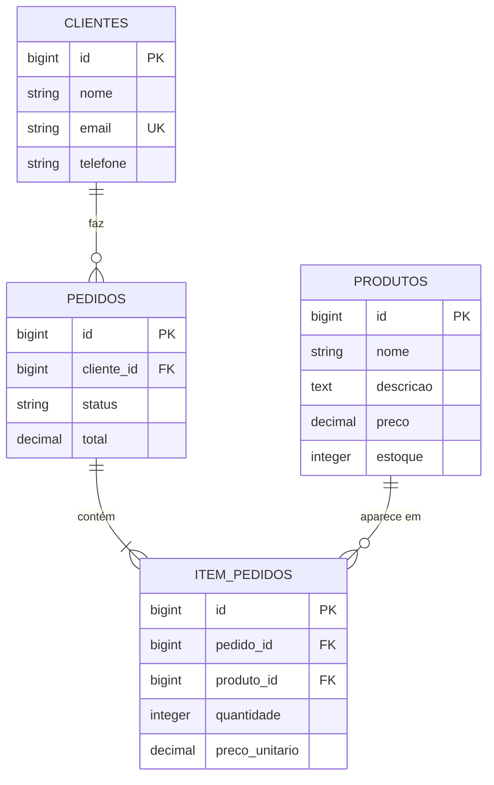

# API Loja

API REST para gestão de **clientes**, **produtos** e **pedidos**, construída com
Ruby on Rails e PostgreSQL.

**Base URL (produção):** `https://api-loja-8xzt.onrender.com`

```bash
curl https://api-loja-8xzt.onrender.com/produtos
```

> ⚠️ O plano gratuito do Render hiberna após ~15 minutos sem uso. A primeira
> requisição depois de um período parado pode levar até 1 minuto enquanto o
> serviço acorda. As seguintes respondem normalmente.

---

## Sumário

- [Sobre](#sobre)
- [Tecnologias](#tecnologias)
- [Modelo de dados](#modelo-de-dados)
- [Regras de negócio](#regras-de-negócio)
- [Referência da API](#referência-da-api)
  - [Convenções](#convenções)
  - [Raiz](#raiz)
  - [Clientes](#clientes)
  - [Produtos](#produtos)
  - [Pedidos](#pedidos)
- [Códigos de status](#códigos-de-status)
- [Rodando localmente](#rodando-localmente)
- [Testes](#testes)
- [Estrutura do projeto](#estrutura-do-projeto)
- [Deploy](#deploy)

---

## Sobre

Esta API modela o fluxo básico de uma loja: um **cliente** faz **pedidos**, e
cada pedido contém vários **produtos** com suas quantidades.

O ponto central do projeto não é o CRUD, e sim a **lógica do pedido**: a API
calcula o total a partir dos preços do banco, baixa o estoque e desfaz tudo se
qualquer etapa falhar. Nenhum valor monetário é aceito vindo do cliente.

---

## Tecnologias

| Camada | Escolha | Por quê |
|---|---|---|
| Linguagem | Ruby 3.4 | — |
| Framework | Rails 8.1 (modo `--api`) | sem views nem assets, stack enxuta que só fala JSON |
| Banco | PostgreSQL 17+ | relacional: chaves estrangeiras, índices, transações e restrições de integridade |
| Servidor | Puma | padrão do Rails |
| Testes | Minitest | padrão do Rails, 27 testes |
| Hospedagem | Render | deploy a partir do GitHub, com Postgres gerenciado |

---

## Modelo de dados



### Por que quatro tabelas e não três

`item_pedidos` é a **tabela de junção**. Sem ela, um pedido só poderia conter um
produto. É ela que permite:

- um pedido ter vários produtos
- um produto aparecer em vários pedidos
- guardar dados *da relação* — `quantidade` e `preco_unitario`

É um relacionamento **N:N com atributos**, e é o motivo de o projeto usar um
banco relacional.

**`item_pedidos` não é um endpoint.** São 4 tabelas, mas 3 recursos na API — os
itens trafegam dentro do JSON do pedido.

### Restrições no banco

Além das validações da aplicação, o banco tem suas próprias garantias:

| Restrição | Tabela | O que impede |
|---|---|---|
| Índice único em `email` | `clientes` | dois clientes com o mesmo email |
| Índice único `(pedido_id, produto_id)` | `item_pedidos` | mesmo produto duas vezes no mesmo pedido |
| `CHECK preco >= 0` | `produtos` | preço negativo |
| `CHECK estoque >= 0` | `produtos` | estoque negativo |
| `CHECK quantidade > 0` | `item_pedidos` | item com quantidade zero ou negativa |
| Chaves estrangeiras | `pedidos`, `item_pedidos` | pedido órfão, item apontando para produto inexistente |

Validação na aplicação protege contra requisições malformadas. Restrição no
banco protege contra **tudo** — inclusive scripts e acesso direto ao SQL.

---

## Regras de negócio

### 1. O cliente nunca envia preço

Ao criar um pedido, o corpo contém apenas `cliente_id`, `produto_id` e
`quantidade`. A API busca o preço atual de cada produto no banco. Se aceitasse
preço da requisição, qualquer um poderia comprar enviando `"preco": 0.01`.

### 2. O preço é congelado no item

O `preco_unitario` gravado em `item_pedidos` é uma **cópia** do preço do produto
no momento da venda. Se o produto for reajustado depois, o pedido antigo mantém
o valor da época — o histórico não é reescrito.

### 3. O total é calculado, nunca recebido

```
subtotal do item = preco_unitario × quantidade
total do pedido  = soma dos subtotais
```

O valor fica gravado na coluna `pedidos.total` e é recalculado por um callback
sempre que os itens mudam.

### 4. O estoque é baixado na criação

Cada produto tem seu `estoque` reduzido pela quantidade pedida. Ao apagar um
pedido, o estoque é devolvido.

### 5. Tudo acontece dentro de uma transação

Se **qualquer** etapa falhar — um item sem estoque, uma validação, um erro de
banco — nada é gravado. Não existe pedido criado pela metade nem estoque baixado
de um item enquanto outro falhou.

> **Demonstração:** envie um pedido com dois itens, o primeiro válido e o
> segundo com quantidade impossível. A resposta é 422 e o estoque do primeiro
> produto **permanece intacto**.

### 6. Histórico é protegido

Clientes e produtos que participam de pedidos **não podem ser apagados**. A API
responde 422 em vez de destruir o histórico de vendas.

---

## Referência da API

### Convenções

| | |
|---|---|
| Base URL | `https://api-loja-8xzt.onrender.com` |
| Formato | JSON em todas as requisições e respostas |
| Header obrigatório em POST/PATCH | `Content-Type: application/json` |
| Autenticação | nenhuma (API pública, projeto acadêmico) |
| Fuso das datas | `America/Sao_Paulo` (`-03:00`) |

**Corpo das requisições** vem sempre aninhado sob o nome do recurso:

```json
{ "cliente": { "nome": "Ana" } }
{ "produto": { "preco": 99.90 } }
{ "pedido":  { "cliente_id": 1, "itens": [] } }
```

**Erros** seguem sempre o mesmo formato:

```json
{
  "errors": [
    "Nome is too short (minimum is 3 characters)",
    "Email nao e um email valido"
  ]
}
```

---

### Raiz

#### `GET /`

Lista os endpoints disponíveis e os totais atuais do banco. Útil para conferir
rapidamente se a API está no ar.

```json
{
  "api": "API Loja",
  "versao": "1.0",
  "endpoints": { "...": "..." },
  "totais": { "clientes": 4, "produtos": 5, "pedidos": 3 }
}
```

#### `GET /up`

Health check do Rails. Responde `200` se a aplicação subiu sem erros. É o
primeiro lugar para olhar quando algo falha no deploy.

---

### Clientes

| Método | Rota | Descrição |
|---|---|---|
| `GET` | `/clientes` | lista todos |
| `GET` | `/clientes/:id` | busca um |
| `POST` | `/clientes` | cria |
| `PATCH` | `/clientes/:id` | atualiza |
| `DELETE` | `/clientes/:id` | remove |
| `GET` | `/clientes/:id/pedidos` | pedidos daquele cliente |

**Campos**

| Campo | Tipo | Obrigatório | Regras |
|---|---|---|---|
| `nome` | string | sim | 3 a 100 caracteres |
| `email` | string | sim | formato válido, único |
| `telefone` | string | não | até 20 caracteres |

O `email` é normalizado antes de salvar: espaços removidos e convertido para
minúsculas. Assim `" ANA@X.COM "` e `"ana@x.com"` são o mesmo cliente.

#### `POST /clientes`

```json
{
  "cliente": {
    "nome": "Ana Souza",
    "email": "ana.souza@exemplo.com",
    "telefone": "11988887777"
  }
}
```

**`201 Created`**

```json
{
  "id": 1,
  "nome": "Ana Souza",
  "email": "ana.souza@exemplo.com",
  "telefone": "11988887777",
  "created_at": "2026-09-10T16:15:06.136-03:00",
  "updated_at": "2026-09-10T16:15:06.136-03:00"
}
```

**`422`** — nome curto, email inválido ou email já cadastrado.

#### `DELETE /clientes/:id`

**`204 No Content`** se o cliente não tem pedidos.

**`422`** se tiver:

```json
{ "errors": ["Cannot delete record because dependent pedidos exist"] }
```

---

### Produtos

| Método | Rota | Descrição |
|---|---|---|
| `GET` | `/produtos` | lista todos |
| `GET` | `/produtos/:id` | busca um |
| `POST` | `/produtos` | cria |
| `PATCH` | `/produtos/:id` | atualiza |
| `DELETE` | `/produtos/:id` | remove |

**Campos**

| Campo | Tipo | Obrigatório | Regras |
|---|---|---|---|
| `nome` | string | sim | 2 a 120 caracteres |
| `descricao` | text | não | até 1000 caracteres |
| `preco` | decimal(10,2) | sim | maior ou igual a zero |
| `estoque` | integer | sim | inteiro, maior ou igual a zero (padrão `0`) |

> `preco` é `decimal`, nunca `float`. Ponto flutuante tem erro de arredondamento
> (`0.1 + 0.2 ≠ 0.3`), inaceitável para dinheiro.

#### `POST /produtos`

```json
{
  "produto": {
    "nome": "Teclado Mecanico",
    "descricao": "Teclado mecanico ABNT2 com switches marrons",
    "preco": 289.90,
    "estoque": 25
  }
}
```

**`201 Created`** — retorna o produto criado.

#### `DELETE /produtos/:id`

**`422`** se o produto estiver em algum pedido — o histórico de vendas é
preservado.

---

### Pedidos

| Método | Rota | Descrição |
|---|---|---|
| `GET` | `/pedidos` | lista todos, do mais recente para o mais antigo |
| `GET` | `/pedidos/:id` | busca um |
| `POST` | `/pedidos` | **cria o pedido com seus itens** |
| `PATCH` | `/pedidos/:id` | altera apenas o status |
| `DELETE` | `/pedidos/:id` | remove e devolve o estoque |

**Status válidos:** `pendente` (padrão), `pago`, `enviado`, `entregue`,
`cancelado`.

#### `POST /pedidos`

O endpoint mais importante da API. Cria o pedido e seus itens numa única
requisição.

```json
{
  "pedido": {
    "cliente_id": 1,
    "status": "pendente",
    "itens": [
      { "produto_id": 1, "quantidade": 2 },
      { "produto_id": 2, "quantidade": 1 }
    ]
  }
}
```

| Campo | Obrigatório | Observação |
|---|---|---|
| `cliente_id` | sim | precisa existir |
| `status` | não | padrão `pendente` |
| `itens` | sim | ao menos um; sem produtos repetidos |
| `itens[].produto_id` | sim | precisa existir |
| `itens[].quantidade` | sim | inteiro maior que zero, dentro do estoque |

**`201 Created`**

```json
{
  "id": 4,
  "status": "pendente",
  "total": "709.7",
  "criado_em": "2026-09-10T16:19:21.102-03:00",
  "cliente": {
    "id": 2,
    "nome": "Bruno Lima",
    "email": "bruno.lima@exemplo.com"
  },
  "itens": [
    {
      "id": 6,
      "produto_id": 1,
      "produto": "Teclado Mecanico",
      "quantidade": 2,
      "preco_unitario": "289.9",
      "subtotal": "579.8"
    },
    {
      "id": 7,
      "produto_id": 2,
      "produto": "Mouse Sem Fio",
      "quantidade": 1,
      "preco_unitario": "129.9",
      "subtotal": "129.9"
    }
  ]
}
```

Repare: `preco_unitario`, `subtotal` e `total` **não foram enviados** — foram
calculados. E o estoque dos produtos 1 e 2 foi reduzido em 2 e 1 unidades.

**Erros possíveis (todos `422`):**

| Situação | Mensagem |
|---|---|
| Estoque insuficiente | `Itens quantidade indisponivel: o produto 'X' tem apenas N em estoque` |
| Nenhum item | `Itens o pedido precisa ter ao menos um item` |
| Produto repetido | `Itens produto repetido no mesmo pedido (X). Use quantidade...` |
| Cliente inexistente | `Cliente must exist` |

#### `PATCH /pedidos/:id`

Apenas o `status` é editável:

```json
{ "pedido": { "status": "enviado" } }
```

Os itens de um pedido criado não podem ser alterados — mexer neles
desequilibraria o estoque que já foi baixado.

#### `GET /clientes/:id/pedidos`

Rota aninhada. Mesma estrutura de resposta de `GET /pedidos`, filtrada por
cliente.

---

## Códigos de status

| Código | Quando |
|---|---|
| `200 OK` | consulta ou atualização bem-sucedida |
| `201 Created` | recurso criado |
| `204 No Content` | recurso removido |
| `404 Not Found` | id não existe |
| `422 Unprocessable Content` | validação falhou ou regra de negócio impediu |
| `500 Internal Server Error` | erro inesperado — não deveria acontecer |

---

## Rodando localmente

**Pré-requisitos:** Ruby 3.4, PostgreSQL 17+, Git.

```bash
git clone https://github.com/sauloribeiroo/api-loja.git
cd api-loja

bundle install
bin/rails db:create db:migrate db:seed
bin/rails server
```

A API sobe em `http://localhost:3000`.

As credenciais locais do banco vêm de variáveis de ambiente, com valores padrão
para desenvolvimento:

| Variável | Padrão |
|---|---|
| `DB_HOST` | `localhost` |
| `DB_PORT` | `5432` |
| `DB_USER` | `postgres` |
| `DB_PASSWORD` | `postgres` |

### Dados de exemplo

O `bin/rails db:seed` cria 4 clientes, 5 produtos e 3 pedidos — com totais
calculados e estoque já ajustado. O arquivo é idempotente: rodar duas vezes não
duplica nada.

### Testando

Importe a coleção [`docs/api-loja.postman_collection.json`](docs/api-loja.postman_collection.json)
no Postman ou Insomnia. São 23 requisições organizadas por recurso, incluindo os
casos de erro.

Depois de importar, ajuste a variável `base_url` da coleção para
`http://localhost:3000` ou para a URL de produção.

---

## Testes

```bash
bin/rails test           # 27 testes
bin/rubocop              # estilo
bin/brakeman             # análise de segurança
```

A cobertura inclui os casos de erro e a verificação de que a transação desfaz a
baixa de estoque quando um item falha.

---

## Estrutura do projeto

```
app/
  controllers/
    clientes_controller.rb    CRUD de clientes
    produtos_controller.rb    CRUD de produtos
    pedidos_controller.rb     pedidos + serialização + itens aninhados
    raiz_controller.rb        índice da API em "/"
  models/
    cliente.rb                validações, has_many :pedidos
    produto.rb                validações, controle de estoque
    pedido.rb                 cálculo do total, transação, callbacks
    item_pedido.rb            cópia do preço, checagem de estoque
config/
  routes.rb                   rotas, incluindo a aninhada
  database.yml                conexão local e produção via DATABASE_URL
db/
  migrate/                    as 4 migrations
  schema.rb                   retrato atual do banco
  seeds.rb                    dados de exemplo
docs/
  banco-de-dados.md           guia do pgAdmin e SQL útil
  deploy-render.md            passo a passo do deploy
  api-loja.postman_collection.json
test/                         27 testes
bin/render-build.sh           script de build do Render
```

---

## Deploy

Hospedado no [Render](https://render.com), com PostgreSQL gerenciado.

| Variável de ambiente | Origem |
|---|---|
| `DATABASE_URL` | fornecida pelo Render ao criar o banco |
| `RAILS_MASTER_KEY` | conteúdo de `config/master.key` (fora do Git) |
| `RAILS_ENV` | `production` |
| `RODAR_SEEDS` | opcional, popula o banco no build |

O passo a passo completo, incluindo os erros mais comuns, está em
[`docs/deploy-render.md`](docs/deploy-render.md).

---

## Guias

- [Acessando o banco pelo pgAdmin](docs/banco-de-dados.md) — conectar, consultas
  SQL úteis e como gerar o diagrama ERD
- [Deploy no Render](docs/deploy-render.md) — passo a passo e solução de problemas

---

## Status

- [x] Ambiente (Ruby 3.4, Rails 8.1, PostgreSQL 17)
- [x] Modelagem e migrations
- [x] Models com validações e relacionamentos
- [x] Controllers, rotas e serialização
- [x] Regras de negócio (total, estoque, transação)
- [x] Seeds
- [x] Testes automatizados
- [x] Deploy no Render
- [x] Coleção do Postman
- [x] Documentação
